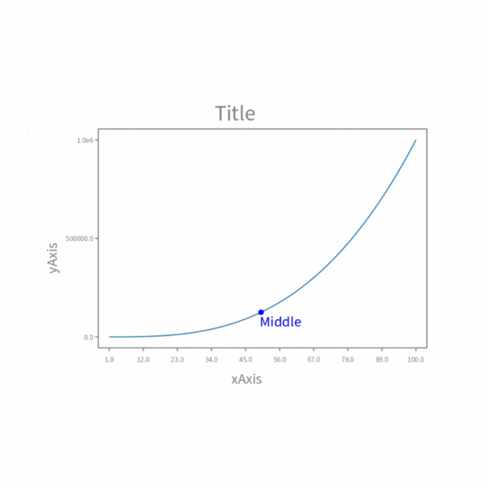

# DLPoster

DLPoster is a data viewer on pharo in progress coding.
This project is the next itration of Roassal3 for Data visualization.

### Installing

Run this script on your pharo9 playground

```st
Metacello new
    baseline: 'DataChart';
    repository: 'github://sambegou122/DLPoster;
    load.
```

### Use:

For a data visualization we will need a good data structure to build on.
For this we use the DataFrame database that you can find (SRC : https://github.com/PolyMathOrg/DataFrame#readme).
	
### Types:
For now we only have two possible display types for our data: Scatter and Line charts

Here are some examples




