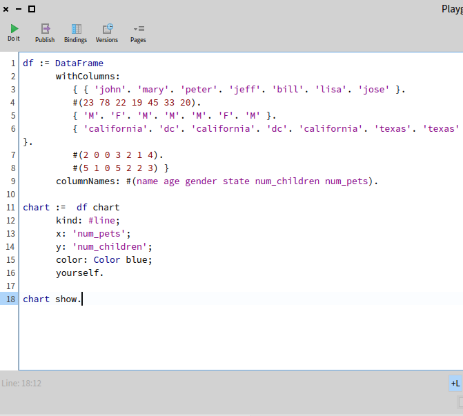
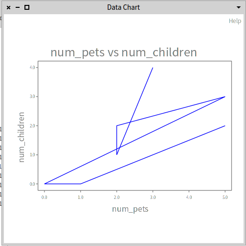

# DLPoster

DLPoster is a data viewer on pharo in progress coding
We are for the moment only at the beginning. So it could be that the structure will change in the next few days. Available from pharo9 and more

### Installation

Run this script on your pharo9 playground

```st
Metacello new
    baseline: 'DataChart';
    repository: 'github://sambegou122/DLPoster:main';
    load.
```

### Use:

For a data visualization we will need a good data structure to build on.
For this we use the DataFrame database that you can find (SRC : https://github.com/PolyMathOrg/DataFrame#readme).
	
### Example:

Here are some examples

``` st
	DCExamples new exampleDCLine open
```
You will see


df is our data structure, to this structure we send a message chart and these arguments
we obtain:


For now we only have two possible display types for our data: Barchart and Line

Another example with line:




