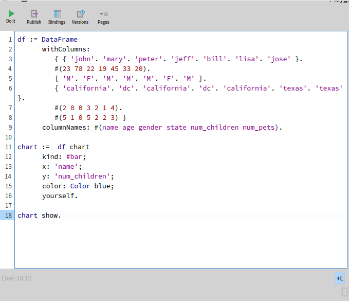
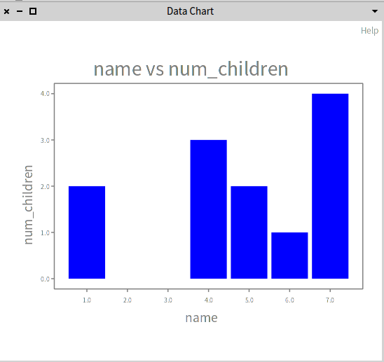

# DLPoster

DLPoster est un visualisateur de données sur pharo encours de codage 
On est pour le moment q'au debut. Donc il se pourais que la structurer change dans les prochains jours 

### Utilisation:
Pour une visualisation de données nous aurons besoin d'une bonne structure de données sur laquelle on pourais se baser.
Pour cela on utulise la base DataFrame que vous pouvez trouver (SRC : https://github.com/PolyMathOrg/DataFrame#readme).
	
### Exemple:
voici quelques exemples 

df est notre structure de données, à cette structure nous envoyons un message chart et ces argument
on obtient:

